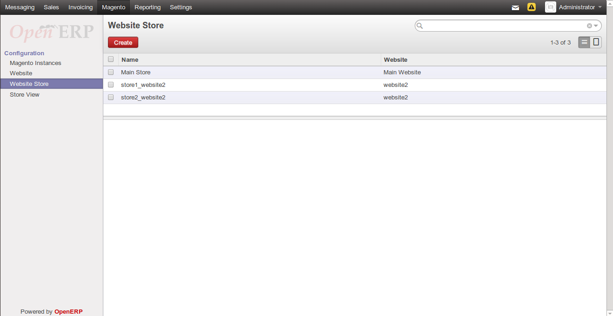
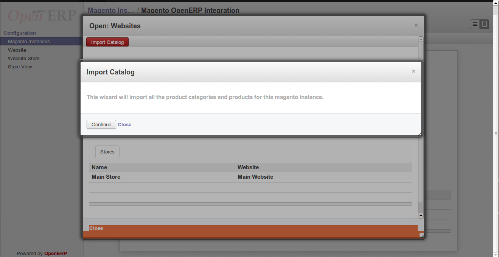

.. _configuration:
   
Configuration
=============

The module requires certain initial configuration to be done in
`magento instance`_ to set the management tool.

.. _magento instance:

**Magento Instance**
---------------------

Go to ``Magento >> Configuration`` and open *Magento Instances*.

It refers to a magento installation identifiable via setting the API for
``Magento Site URL``, ``API User`` and ``API Password / Key``

1. Create a new ``magento instance`` by clicking create.

    .. image:: _images/save_magento_instance.png
       :width: 800

2. Save the record with the ``Save`` button.

3. The Connection can be tested by clicking on  ``Test Connection`` button
   shown on the top.

4. If the connection with magento is successful, a window will pop-up as
   shown below in the screenshot:

    .. image:: _images/test_connection.png
       :width: 800

5. Now the websites can be imported by clicking ``Import Websites`` button.
   This will import all the websites for this magento instance. It will
   also import all the stores and store views related to this website. By
   clicking this a new window will pop-up as shown below:

   .. image:: _images/Import_website.png
      :width: 800

To know more about *Magento Website*, refer `website`_.

.. _website:
       
**Magento Website**
-------------------

Go to ``Magento >> Configuration`` and open *Website*.

A magento instance can have multiple websites. They act as *parents* of stores.
A website consists of one or more stores.

After Importing Websites, magento instance will get all the websites, it's
stores and stores view. See below:

.. image:: _images/Website.png
   :width: 800
   :align: center

.. note::
   A website must be unique in an magento instance

.. _website store:

**Website Store**
-----------------

``Magento Website Store or Store view groups``

Go to ``Magento >> Configuration`` and open *Website Store*.

Stores are ``children`` of websites. The visibility of products and categories
is managed on magento at store level by specifying the root category on a store.
The setup for root catalog on stores does not reflect on OpenERP as there
is no functional benefit of doing so.

.. note::
    A store must be unique in a website

Double click on any of of the website to import catalog by clicking on
``Import Catalog``. This will import all the product categories and
products for this magento instance, see screenshot:

Press continue to import the catalog, and it will get all the products, see
below screenshot:

.. image:: _images/Products.png
   :width: 800

.. note:: 
   Each product in a website must be unique!

.. _store view:

**Store View**
--------------

``Magento Website Store View``

Go to ``Magento >> Configuration`` and open *Store View*.

A store needs one or more store views to be browse-able in the front-end. It
allows for multiple presentations of a store. Most implementations use store
views for different languages.

See screenshot below, it will get all the ``Store View`` with corresponding
``Store``

.. image:: _images/Store_view.png
   :width: 800
