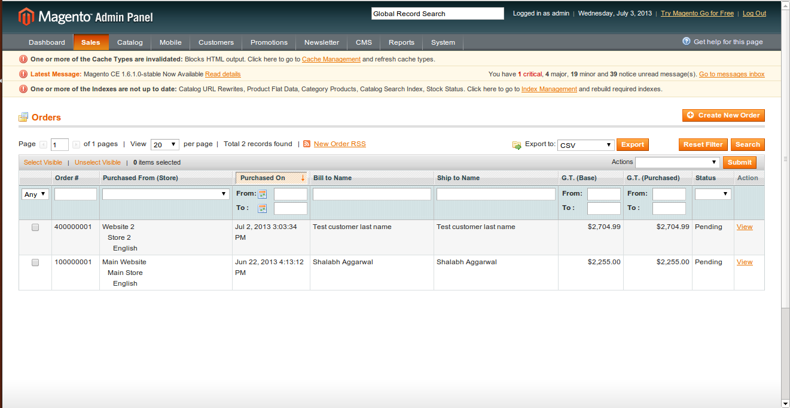
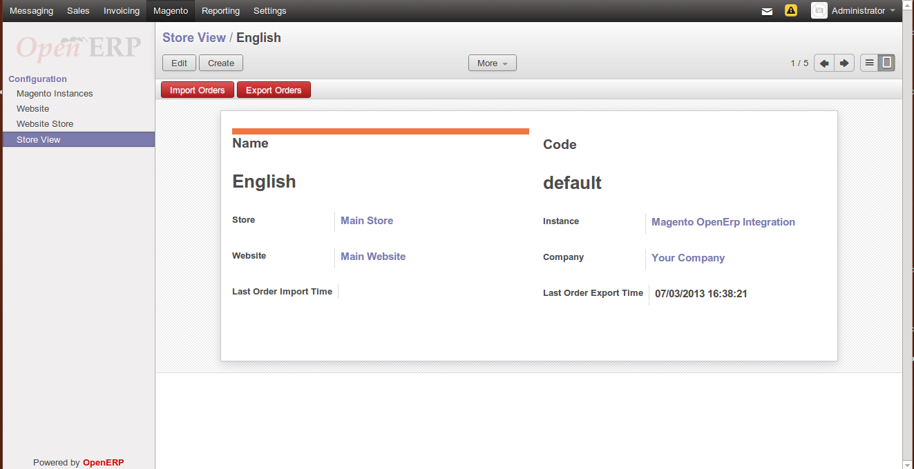
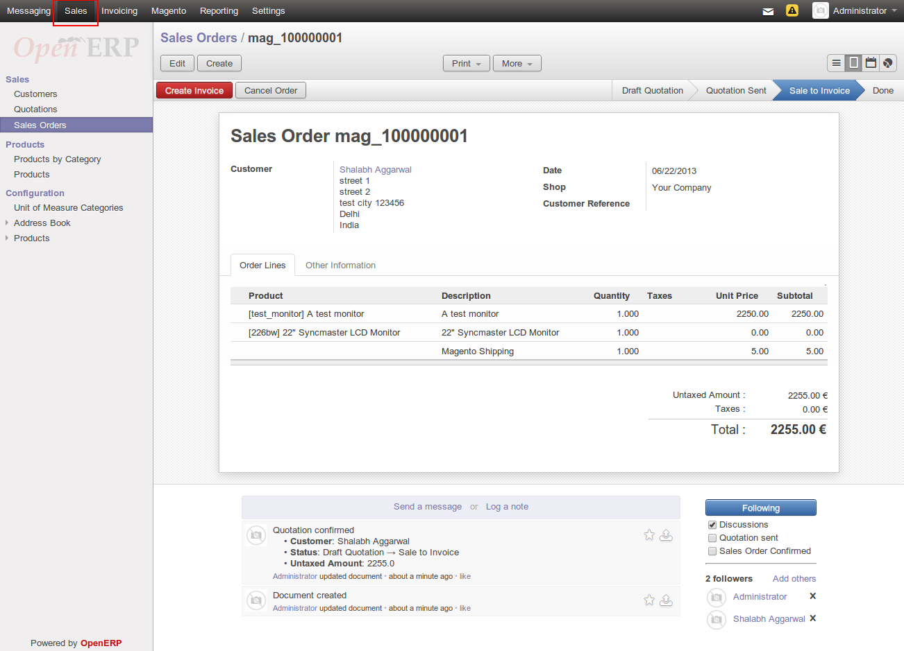
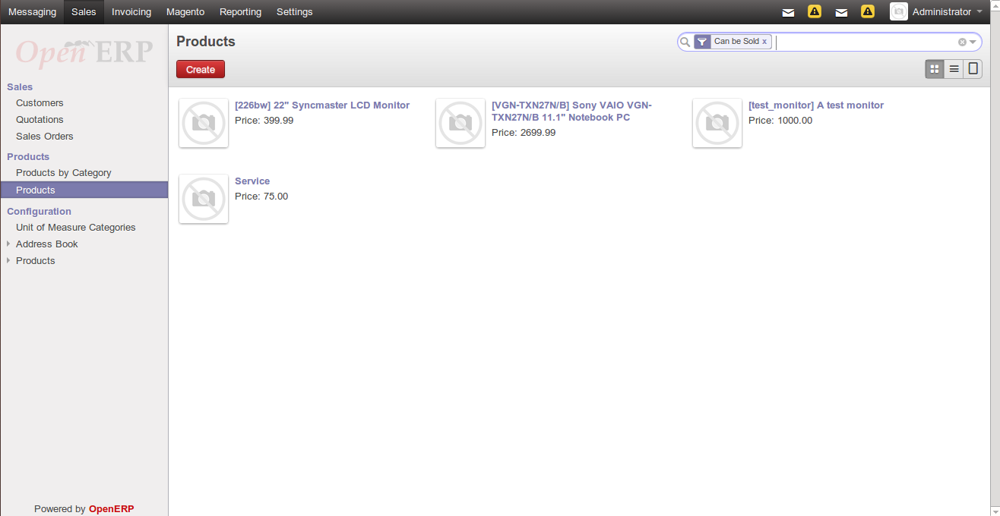
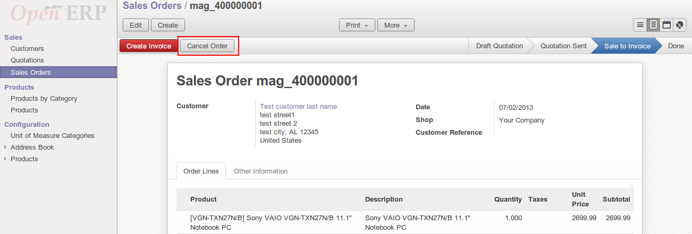
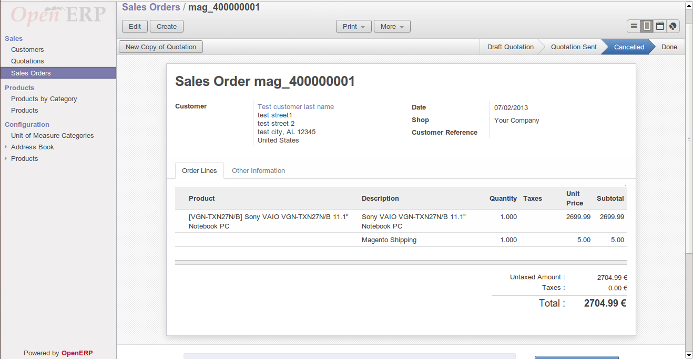
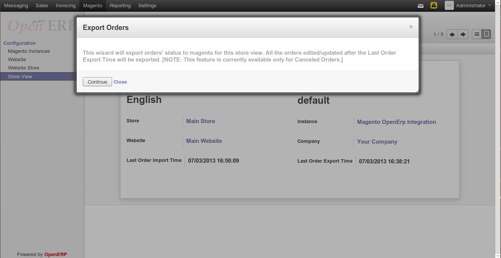
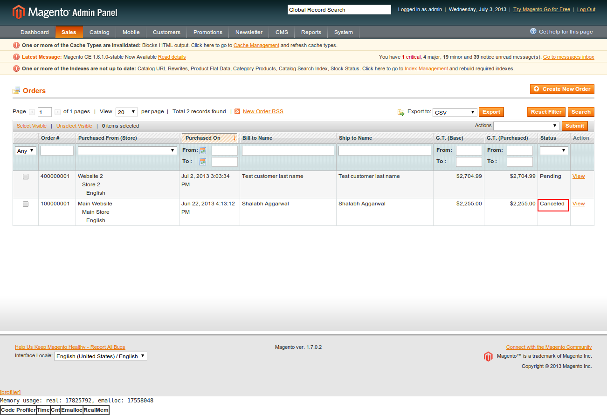

Create Sale Orders in Magento
=============================

Sales orders in Magento can created from Magento Admin Panel with ``Create
New Button`` shown in below `Create New Order`_ screenshot.

.. _Create New Order:

**Sale in Magento**

**Orders in Magento**

.. image:: _images/Sales_orders_order.png
   :width: 800
   :align: center

How it Works
============

This section explains how import and export of orders between OpenERP and
Magento works.

.. note::
   All the data represented below is demo data and is only for demonstration
   purposes.

Orders are imported as Sales
----------------------------

Orders placed in Magento Admin Panel are imported in OpenERP from ``Store
View``. See below:

An order in Magento has a number of entities related and they are
imported in OpenERP as described below:

* The Order is imported as a Sale. The sale in OpenERP can be identified by
  the Order Number which will be same as the order reference in Magento.
  Internally the matching is done using the ID of the order as returned by
  Magento.

* The date on which it order is generated

* The Customer who placed the order as a Sale.

* The products, i.e., the products bought in the order by the customer are
  imported as Sale lines. The product in each of these lines is created as
  product in OpenERP, if it does not already exist.

A window pop-ups to import all sale orders placed on this store view.
Enter Continue, refer screenshot shown below:

.. image:: _images/Continue_import_orders.png
   :width: 800
   :align: center

**Order imported as Sales in OpenERP**

| ``Sales >> Sales Orders``

.. note::
   When the order import happens next time, the status of the orders in
   state in OpenERP will be updated if there is a change in state on Magento.

**Product in OpenERP**

The products bought in the order by the customer are imported. The product in
each of the sale lines is created as product in OpenERP, if it does not already
exist.

Cancellation Of Sale Order
--------------------------

Double click on the order from the sale order lines to edit it. To cancel
the order click ``Cancel Order`` button as shown in below screenshot:

Now state has been changed to cancelled, see below

**Cancelled Sale Order**

Now to export the changes to Magento, refer `export order`_

.. _export order:

Exporting Order Status from OpenERP to Magento
----------------------------------------------

Once the order is processed in OpenERP, the shipping status of the order
based on delivery is updated on Magento by Export Order.

This will export order's status to magento for this store view

* The status of orders which are imported in OpenERP will be exported to
  Magento as `Cancelled` once they are marked `Cancelled` by editing sale order
  from OpenERP.

**Canceled order in Magento**

.. note::
   This feature is currenctly available for Cancelled Orders
